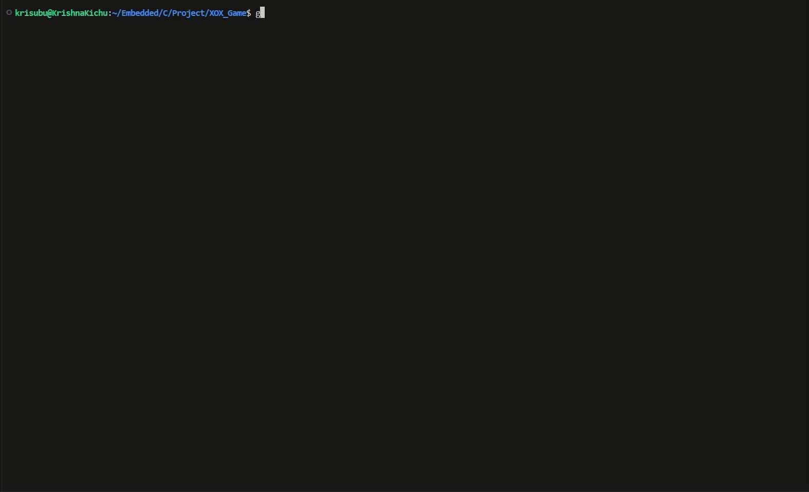

# Tic Tac Toe in C

Play a classic Tic Tac Toe game on your console! This project is a simple yet fun way to practice C programming and logic-building skills.

## Game Highlights
- Two-player mode: Player X vs Player O
- Win detection: Rows, columns, and both diagonals
- Automatically declares winner or draw
- Handles invalid inputs gracefully

## Getting Started
Follow these steps to run the game:

### Compile the Code
gcc tictactoe.c -o tictactoe

### Launch the Game
./tictactoe

## How to Play
- The game is for two players.
- Players take turns entering the row and column numbers to place their symbol (X or O).
- The board updates and prints after each move.
- The game ends when a player wins or all cells are filled (draw).

### Controls
- Enter row number (0-2)
- Enter column number (0-2)

Example move:
Player X, enter row (0-2): 1  
Player X, enter column (0-2): 2

## Technical Details
- Written in C Language
- Uses 2D arrays to represent the board
- Loops and conditionals handle gameplay flow and win/draw logic

## Skills You’ll Learn
- Managing a 2D array as a dynamic game board
- Implementing win/draw logic from scratch
- Handling user input validation and edge cases
- Structuring a small, clean C project

## Usage Example
Compile the program:  
gcc tictactoe.c -o tictactoe

Run the game:  
./tictactoe

Example Gameplay:
Player X, enter row (0-2): 0  
Player X, enter column (0-2): 1

   0   1   2
0    | X |  
  ---+---+---
1    |   |  
  ---+---+---
2    |   |  

## Demo

---
